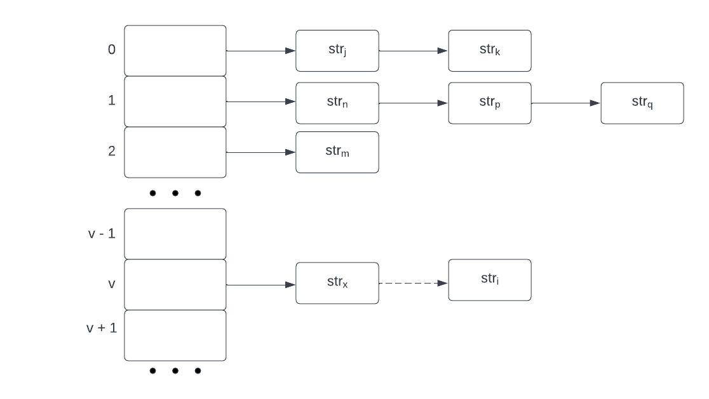
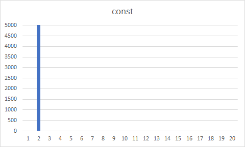
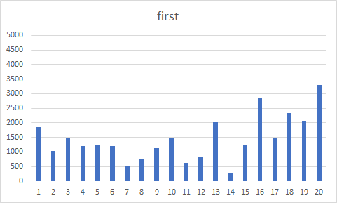
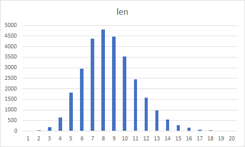
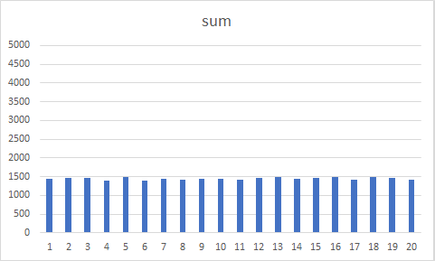
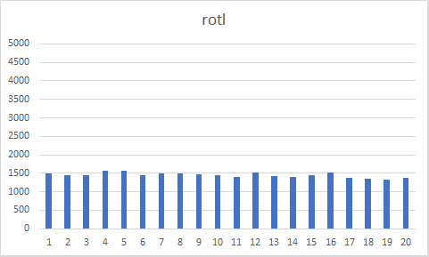
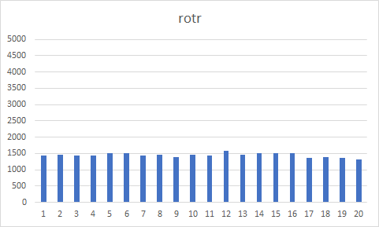
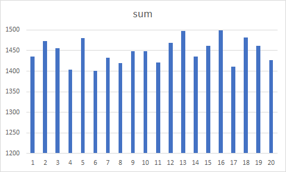
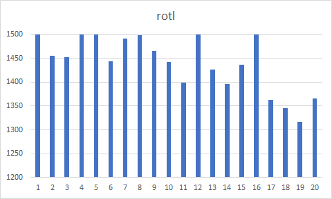
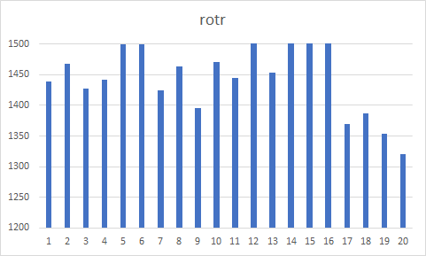

# Оптимизация хеш-функций
## Введение
Хеш-таблицы часто применаются в базах данных и компиляторах, поэтому важно выбрать хорошие хеш-функции с малым количеством коллизий и ускорить выполнение этих функций.
Работа состоит из двух частей: в первой части проводится анализ ряда хеш-функций на равномерность распределения, 
а во второй проводится оптимизация одной хеш-функции несколькими способами.

## Часть 1. Анализ равномерности распределения.

### 1.1. Теоретические сведения.
Вспомним основные теоретические сведения про хеш-таблицы и хеш-функции.
> Хеш-таблица - это структура данных, хранящая пары (ключ, значение) и позволяющая быстро осуществлять операции добавления пары, удаления пары и поиска пары по ключу.

В этой работе для простоты ключ пары совпадал со значением и представлял собой строку, состояющую из символов ASCII-таблицы.

> Хеш-функция - это функция, отображающая данные в целые числа.

Рассмотрим закрытое хеширование методом цепочек. Тогда в нашем примере хеш-таблица - это массив списков строк. 
Обозначим хеш-функцию как $h(k)$. В нашем примере функция $h(k)$ отображает строки в индексы массива.
Пусть $h(str_i) = v$, тогда строку $str_i$ нужно добавить в список, находящийся в массиве по индексу $v$ (см. рис.).

### 1.2. Примеры хеш-функций.
В первой части работы рассмотрим неколько хеш-функций:
1. $h = const(k)$. Эта функция всегда возвращает $1$.
2. $h = first(k)$. Эта функция возвращает число, соответствующее ASCII-коду первого символа строки, взятое по модулю длины хеш-таблицы.
3. $h = len(k)$. Эта функция возвращает длину строки, взятую по модулю длины хеш-таблицы.
4. $h = sum(k)$. Эта функция возвращает сумму чисел, соответствующих ASCII-кодам символов строки, взятую по модулю длины хеш-таблицы.
5. $h = rotl(k)$. Обозначим $rol(c)$ - циклический сдвиг битов числа, соответствующего ASCII-коду символа $c$, влево на $1$, $\wedge$ - исключающее побитовое ИЛИ,
$k[i]$ - число, соответствующее ASCII-коду i-го символа строки $k$, $j$ - индекс последнего символа строки $k$.
Пусть $H_{i + 1} = rol(H_i) \wedge  k[i]$, $H_0 = 0$. Тогда функция возвращает $H_j$.
6. $h = rotr(k)$. Эта функция производит те же операции, что и $rotl(k)$, но производит циклический сдвиг вправо, а не влево.

### 1.3. Методика измерений.
Для анализа равномерности распределения построим хеш-таблицу небольшого размера и выполним хеширование большого количества строк. 
В этой работе выбрана хеш-таблица размера 20.
В качестве источника строк был выбран текст с [сайта](https://ocw.mit.edu/ans7870/6/6.006/s08/lecturenotes/files/t8.shakespeare.txt).
С помощью [сервиса](https://onlinetexttools.com/find-unique-text-words) из этого текста был получен [файл](shakespeare.txt), стостоящий из 28959 слов - каждое слово на отдельной строке.
Для каждой функции из пункта 1.2 построим хеш-таблицу по этим словам и вычислим длины списков в каждом элементе массива таблицы.

### 1.4. Результаты измерений.
На графиках ниже изображены распределения коллизий для всех рассматриваемых хеш-функций.

Для функции $h = const(k)$ график не поместился в выбранный масштаб, но очевидно, что в более мелком масштабе график будет представлять собой столб высотой 28959.
Легко заметить, что наиболее равномерные распределения у функций $h = sum(k)$, $h = rotl(k)$ и $h = rotr(k)$.
Для этих функций построим графики в более крупном масштабе.

Легко заметить, что наиболее равномерным распределением обладает функция  $h = sum(k)$.
